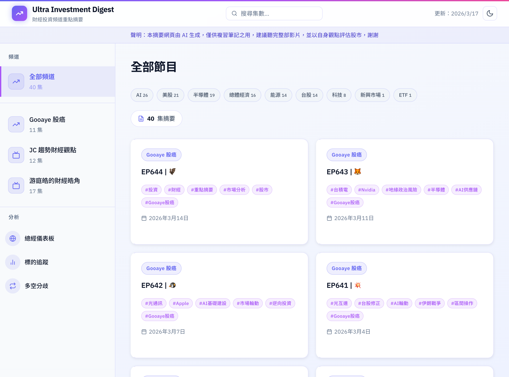

# Ultra Investment Digest

> YouTube 財經投資頻道 ＋ 電子報自動摘要工具

[](https://github.com/ultrahikerpp/invest-digest/releases)
[](https://www.python.org/)
[](LICENSE)
[](README.md)
[](https://ultrahikerpp.github.io/invest-digest/)

每天自動抓取訂閱頻道的最新影片與投資電子報，透過 Whisper 轉錄逐字稿（YouTube）或直接讀取郵件全文（電子報）、Claude AI 整理成結構化投資重點摘要與字卡，並部署為 GitHub Pages 靜態網站供瀏覽器查看。

---

## Demo



🔗 **線上預覽：** https://ultrahikerpp.github.io/invest-digest/

---

## 環境需求

| 項目 | 版本 / 需求 |
| --- | --- |
| Python | 3.9 以上 |
| Google Chrome | 已安裝，且已在 Chrome 中登入 [claude.ai](https://claude.ai) |
| ffmpeg | 產生 MP4 影片時需要（`brew install ffmpeg`） |
| 作業系統 | macOS（Windows / Linux 尚未支援） |
| Gmail | 需設定應用程式密碼（App Password）以發送通知信；需啟用 IMAP（設定 → 轉寄和 POP/IMAP → 啟用 IMAP）以接收電子報 |

---

## 快速開始

### 1. 安裝依賴套件

```bash
pip3 install -r requirements.txt
```

### 2. 設定環境變數

```bash
cp .env.example .env
# 編輯 .env，填入 GMAIL_APP_PASSWORD（Gmail 應用程式密碼）
```

### 3. 設定 Claude 瀏覽器登入

本工具透過 Playwright 自動化操作 Chrome 瀏覽器，從 Chrome 讀取已登入的 claude.ai session cookies，**不需要輸入帳號密碼**。

```bash
# 確認 Chrome 已登入 claude.ai，然後執行驗證
./venv/bin/python runner.py setup-browser
```

---

## 日常工作流程

```
runner.py run      →  新集數轉錄 + 摘要，寄送審閱通知信（僅此一次）
     ↓ （收到信後人工確認摘要內容）
runner.py approve  →  產生 hashtags + 字卡 + 影片，自動部署網站
```

---

## 常用指令

> **注意**：所有指令請使用 venv 的 Python，或先執行 `source venv/bin/activate` 啟動虛擬環境。

```bash
# 抓取所有頻道最新集數、轉錄、生成摘要，並寄送審閱通知信
./venv/bin/python runner.py run

# 只抓取特定頻道
./venv/bin/python runner.py run --channel <channel_id>

# 處理所有待審閱集數：產生 hashtags、字卡、影片，並自動部署網站
./venv/bin/python runner.py approve

# 重新產生靜態網站（docs/）
./venv/bin/python runner.py build

# 部署：build + commit + push 到 GitHub Pages
./venv/bin/python runner.py deploy

# 產生指定影片的摘要字卡 PNG
./venv/bin/python runner.py cards <video_id>

# 產生指定影片的摘要短影片 MP4
./venv/bin/python runner.py video <video_id>

# ── Shorts 短影音 ──

# 產生指定影片的 Shorts 9:16 字卡 PNG（hook + 各段落 + CTA）
./venv/bin/python runner.py shorts-cards <video_id>

# 組裝 Shorts 字卡成 MP4 短影音
./venv/bin/python runner.py shorts-video <video_id>

# 發送最新集數影片通知 Email
./venv/bin/python runner.py notify

# 驗證 Chrome 中的 claude.ai 登入狀態
./venv/bin/python runner.py setup-browser

# ── 週報 ──

# 生成本週跨頻道 AI 觀點合成週報（需 Claude browser，約 2-5 分鐘）
./venv/bin/python runner.py weekly

# ── 標的分析 ──

# 對所有歷史摘要補跑分析（首次啟用時執行一次）
./venv/bin/python runner.py backfill-analysis

# 查看近 30 天熱門標的 Top 10 與產業熱度
./venv/bin/python runner.py trending
./venv/bin/python runner.py trending --days 60

# 查詢特定標的的所有提及紀錄
./venv/bin/python runner.py track --name 台積電

# 查看各頻道對同一標的的多空立場比較
./venv/bin/python runner.py divergence
./venv/bin/python runner.py divergence --days 180 --min-channels 2
```

---

## 電子報整合（FOMO研究院 KP思考筆記）

### 支援來源

目前支援抓取 **FOMO研究院「KP思考筆記」週更免費電子報**（每週六發送），透過 Gmail IMAP 讀取郵件全文，不需要 Whisper 轉錄。

### 設定方式

電子報來源設定在 `channels.json` 的 `newsletters` 區塊（與 YouTube `channels` 分開）：

```json
{
  "channels": [ ... ],
  "newsletters": [
    {
      "channel_id": "fomo-newsletter",
      "name": "FOMO研究院",
      "type": "newsletter",
      "sender": "fomosoc@substack.com",
      "subject_filter": "KP思考筆記",
      "thumbnail_url": "",
      "active": true
    }
  ]
}
```

| 欄位 | 說明 |
| --- | --- |
| `sender` | 寄件人 Email，用於 IMAP 搜尋 |
| `subject_filter` | 主旨關鍵字篩選，只處理包含此字串的信件（免費週更用 `KP思考筆記`，排除付費深入分析） |
| `active` | `false` 可暫停抓取 |

### 工作流程

電子報的處理流程與 YouTube 完全相同：

```
runner.py run  →  Gmail IMAP 抓取最新電子報 → Claude AI 生成摘要
                  → 寄送審閱通知信 → 人工確認
runner.py approve  →  hashtags + 字卡 + 自動部署
```

- `run` 執行時 YouTube 頻道與電子報會**同時處理**
- `--channel` 參數僅針對 YouTube 單一頻道；電子報只在全頻道 run 時執行
- 已處理過的期數透過 SQLite 去重，不會重複產出

### 電子報 vs YouTube 差異

| 項目 | YouTube | 電子報 |
| --- | --- | --- |
| 內容取得 | yt-dlp 下載音訊 + Whisper 轉錄 | Gmail IMAP 讀取郵件純文字 |
| 摘要 prompt | 逐字稿整理（有廣告段落過濾） | 文章整理（多主題結構化） |
| 原始連結 | YouTube 影片網址 | Substack 文章網址 |
| 字卡章節 | 核心觀點、提及標的… | 本期主題總覽、各主題重點… |
| 網站按鈕 | 「YouTube 觀看原片」 | 「閱讀原文於 Substack」 |

### 新增其他電子報

在 `channels.json` 的 `newsletters` 陣列新增一筆記錄即可，`sender` 填對方寄件地址，`subject_filter` 填用於識別免費信件的主旨關鍵字。

---

## 標的追蹤與產業分類

每次 `run` 產生摘要後，會自動呼叫 Claude 對摘要進行二次萃取，識別提及的投資標的（含多空情緒）與產業標籤，並寫入資料庫與 frontmatter。

```bash
# 對所有歷史摘要補跑分析（一次性回填，首次啟用時執行）
./venv/bin/python runner.py backfill-analysis

# 查看近 30 天熱門標的 Top 10 與產業熱度
./venv/bin/python runner.py trending

# 指定天數範圍
./venv/bin/python runner.py trending --days 60

# 查詢特定標的的所有提及紀錄
./venv/bin/python runner.py track --name 台積電
./venv/bin/python runner.py track --name NVDA

# 查看各頻道對同一標的的多空立場比較（近 90 天，2+ 頻道）
./venv/bin/python runner.py divergence

# 調整時間範圍與最低頻道數
./venv/bin/python runner.py divergence --days 180 --min-channels 2
```

`build` / `deploy` 時會同步產生下列靜態資料檔，供網站各頁面使用：

| 檔案 | 說明 |
| --- | --- |
| `docs/data/mentions.json` | 熱門標的排行（含看多／看空／中立比例）、產業熱度 |
| `docs/data/entity_history.json` | 每個標的的跨集提及歷史與情緒紀錄 |
| `docs/data/divergence.json` | 跨頻道多空分歧分析 |
| `docs/data/cooccurrence.json` | 標的共現分析（同集常一起出現的標的） |
| `docs/data/flips.json` | 近期情緒翻轉標的 |
| `docs/data/weekly_latest.md` | 最新一期 AI 週報（GitHub Pages 用，由 `deploy` 從 `data/weekly/` 複製而來） |
| `docs/data/weekly_meta.json` | 週報元資料（期數、集數、生成時間） |
| `docs/feed.xml` | RSS 2.0 訂閱 Feed（最新 30 集） |

### 週報雙檔說明

週報存在兩個位置，用途不同：

| 路徑 | 用途 | 是否上傳 GitHub |
| --- | --- | --- |
| `data/weekly/YYYY-WW.md` | 本機歷史存檔（每期保留） | ❌ gitignored |
| `docs/data/weekly_latest.md` | GitHub Pages 顯示用（永遠只放最新一期） | ✅ |

`runner.py weekly` 執行時，會將結果寫入 `data/weekly/YYYY-WW.md`（本機存檔）。
`runner.py deploy` 再把最新那份複製到 `docs/data/weekly_latest.md` 並 commit/push。

> 若只跑 `weekly` 而未跑 `deploy`，需手動 commit `docs/data/weekly_latest.md` 才會更新 GitHub Pages。

---

## 網站功能

靜態網站（`docs/index.html`）提供以下功能頁面：

| 路由 | 功能 |
| --- | --- |
| `#/` | 全部集數列表 |
| `#/channel/<id>` | 單一頻道集數列表 |
| `#/trending` | 標的追蹤：熱門標的排行榜、產業熱度 |
| `#/entity-search` | **標的搜尋**：輸入名稱或代號（台積電、NVDA、2330）即時搜尋所有 257+ 標的 |
| `#/entity/<name>` | **標的深度頁**：跨集提及歷史、情緒分布、相關標的、分享卡片 |
| `#/watchlist` | **自選標的**：LocalStorage 儲存的個人關注清單 |
| `#/weekly` | **AI 週報**：跨頻道觀點合成（由 `runner.py weekly` 生成） |
| `#/divergence` | 跨頻道多空分歧分析 |
| `#/macro` | 總經儀表板 |

**標的深度頁額外功能：**
- ⭐ 加入／移除自選（LocalStorage）
- 📤 分享卡片：生成 1080×1080 PNG 可下載分享
- 🔗 相關標的：同集常一起出現的標的推薦

**RSS 訂閱：** `docs/feed.xml`（每次 build 自動更新，可用 Feedly / Reeder 訂閱）

---

## 啟動本地預覽伺服器

```bash
cd docs && python3 -m http.server 8000
```

開啟瀏覽器前往 http://localhost:8000

---

## 設定每日自動批次執行（Crontab）

每天早上 8:30 自動執行 `run`，9:00 發送通知，log 寫入 `data/runner.log`：

```bash
# 開啟 crontab 編輯器
crontab -e
```

加入以下這行（請將路徑替換成實際專案路徑）：

```
30 8 * * * cd /path/to/investment-digest && ./venv/bin/python runner.py run >> data/runner.log 2>&1
0  9 * * * cd /path/to/investment-digest && ./venv/bin/python runner.py notify >> data/runner.log 2>&1
```

查看執行 log：

```bash
tail -f data/runner.log
```

---

## 專案結構

```
investment-digest/
├── runner.py              # 主 CLI（run / approve / build / cards / video / deploy / notify / weekly）
├── build_site.py          # 靜態網站產生器
├── channels.json          # 訂閱頻道設定
├── backend/
│   ├── worker.py              # 核心邏輯（RSS 抓取、Whisper 轉錄、Email 通知）
│   ├── newsletter_fetcher.py  # Gmail IMAP 電子報抓取（KP思考筆記等免費電子報）
│   ├── claude_browser.py      # Claude AI 瀏覽器自動化（摘要、hashtags、字卡金句、標的萃取）
│   ├── analyzer.py            # 標的追蹤 DB 操作（mentions / episode_industries）
│   ├── card_generator.py      # 字卡 PNG 產生（Pillow）
│   ├── dqs.py                 # 摘要品質評分（DQS）
│   └── video_maker.py         # 短影片 MP4 組裝
├── docs/                  # GitHub Pages 靜態網站
│   ├── index.html         # 單頁應用（SPA，Vanilla JS）
│   ├── feed.xml           # RSS 2.0 訂閱 Feed（build 時自動產生）
│   ├── screenshot.png     # 網站截圖（README 用）
│   ├── summaries/         # Markdown 摘要（由 build_site.py 複製）
│   └── data/
│       ├── episodes.json        # 集數索引
│       ├── mentions.json        # 標的熱度與產業統計
│       ├── entity_history.json  # 每個標的的跨集提及歷史
│       ├── divergence.json      # 跨頻道多空分歧
│       ├── cooccurrence.json    # 標的共現分析
│       ├── flips.json           # 情緒翻轉標的
│       ├── weekly_latest.md     # 最新 AI 週報
│       └── weekly_meta.json     # 週報元資料
└── data/
    ├── subscriptions.db   # SQLite（episodes / mentions / episode_industries）
    ├── summaries/         # Markdown 摘要（原始資料，依頻道分資料夾）
    ├── weekly/            # AI 週報歷史（YYYY-WW.md，本機存檔，不上傳 GitHub）
    ├── transcripts/       # Whisper 逐字稿（本機，不上傳）
    ├── cards/             # PNG 字卡（本機，不上傳）
    ├── videos/            # MP4 影片（本機，不上傳）
    └── runner.log         # 每日批次執行 log
```

---

## 技術架構重點

- **無 YouTube Data API**：透過 RSS feed 抓取影片清單
- **無 Gemini / OpenAI API**：透過 Playwright 自動化操作 Chrome，讀取 Chrome 本機的 claude.ai session cookies，直接使用 Claude.ai 網頁介面產生摘要與金句
- **無 Web Server**：靜態 GitHub Pages；所有資料於建置時預先產生
- **兩階段工作流程**：`run` 產出摘要進入 `pending_review`，人工確認後執行 `approve` 產出字卡與影片並自動部署
- **SQLite 狀態追蹤**：`data/subscriptions.db` 記錄每集狀態（`pending_review` / `done`），以及 `mentions`、`episode_industries` 表儲存標的與產業分析結果
- **電子報支援**：透過 Gmail IMAP 讀取郵件純文字，省去音訊下載與 Whisper 轉錄；`channels.json` 的 `newsletters` 區塊獨立設定，與 YouTube 頻道共用相同的摘要→審閱→部署流程

---

## 摘要 Frontmatter 格式

```yaml
---
title: EP639 | 🐗
video_id: Y3UKwjPIVeE
channel_id: UC23rnlQU_qE3cec9x709peA
channel_name: Gooaye 股癌
published: 2026-02-27
processed: 2026-02-27
hashtags: #台股 #ETF #升息 #通膨 #資產配置 #Gooaye股癌
industries: 台股, ETF, 總體經濟
---
```

電子報摘要的 frontmatter 格式如下（多了 `source_type` 和 `source_url`）：

```yaml
---
title: 美光財報的重點？巨頭發起光通訊新憲法？- KP思考筆記(第34期)
video_id: kp-newsletter-34
channel_id: fomo-newsletter
channel_name: FOMO研究院
source_type: newsletter
source_url: https://fomosoc.substack.com/p/openai-kp34
published: 2026-03-21
processed: 2026-03-22
hashtags: #美光 #NVIDIA #AI #光通訊 #科技股 #FOMO研究院
industries: 半導體, AI, 科技
---
```

`industries` 欄位由 `run` 或 `backfill-analysis` 自動填入，最多 3 個，從固定清單選取：
台股、美股、中港股、半導體、AI、科技、金融、房地產、能源、原物料、生技醫療、ETF、總體經濟、加密貨幣、新興市場

---

## 已知限制

- **僅支援 macOS**：瀏覽器 cookie 讀取使用 macOS Keychain，尚未支援 Windows / Linux
- **需保持 Chrome 登入狀態**：若 claude.ai session 過期，需重新登入 Chrome 後再執行
- **不穩定性**：依賴 claude.ai 網頁介面，若 Claude 改版 UI 可能需要更新 selector

---

## 貢獻指南

歡迎提交 Issue 或 Pull Request！

1. Fork 此專案
2. 建立功能分支：`git checkout -b feat/your-feature`
3. 提交變更：`git commit -m "feat: add your feature"`
4. 推送分支：`git push origin feat/your-feature`
5. 開啟 Pull Request

**Commit 格式**：請遵循 [Conventional Commits](https://www.conventionalcommits.org/)，類型包括：`feat`、`fix`、`refactor`、`docs`、`chore`

---

## License

[MIT](LICENSE) © 2026 ultrahikerpp
